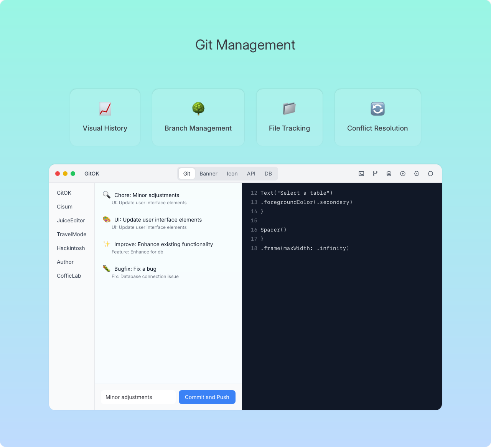

# GitOK

📖 [中文版](README-zh.md) | [English](README.md)

## What

GitOK 是一个综合性的项目管理工具。

## 截图

## 下载

<https://github.com/CofficLab/GitOK/releases>

## Why

有很多方式来保证工作流程简洁、高效、规范，比如：

- 约束性的文档
- 规范代码格式的脚本

为什么不用一个人性化的 APP 来做这些事呢？

我们需要一个工具来提高工作效率，希望它有这样的功能：

- 管理多个项目
- 创建一个项目，背后的工作包括但不限于：
  - 用脚手架创建项目文件夹
  - 初始化 Git 仓库及远程仓库
  - 准备好 CI/CD 脚本
- 辅助人类提交良好格式的 `commit message`
- 快速生成 APP 的多个平台的图标

## Our Other Projects

* [Cisum](https://github.com/CofficLab/Cisum_SwiftUI) - Apple 平台音频播放器

## References

- [git commit emoji 使用指南](https://github.com/liuchengxu/git-commit-emoji-cn)
